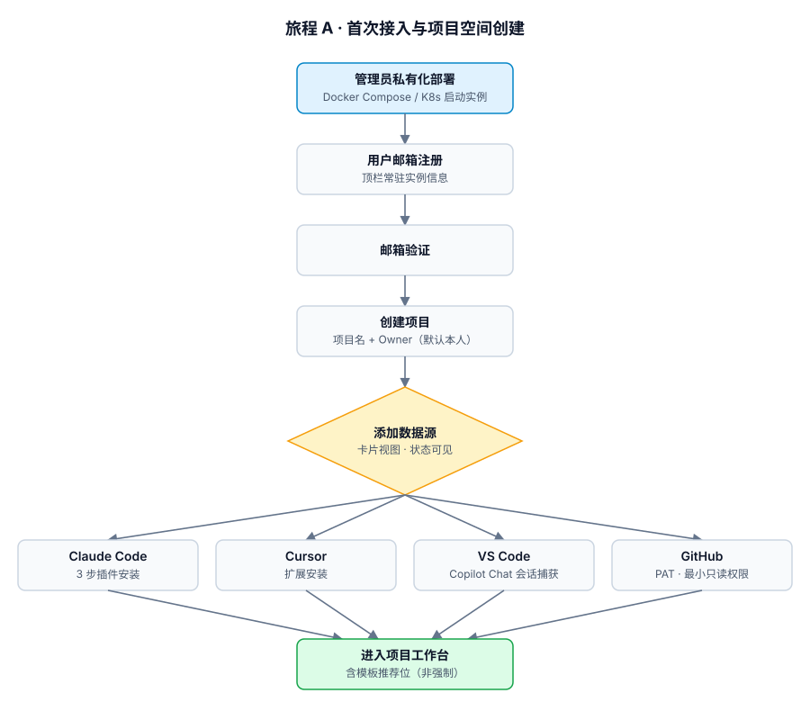
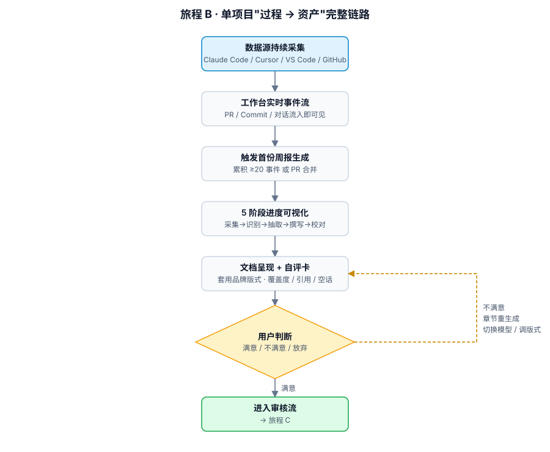
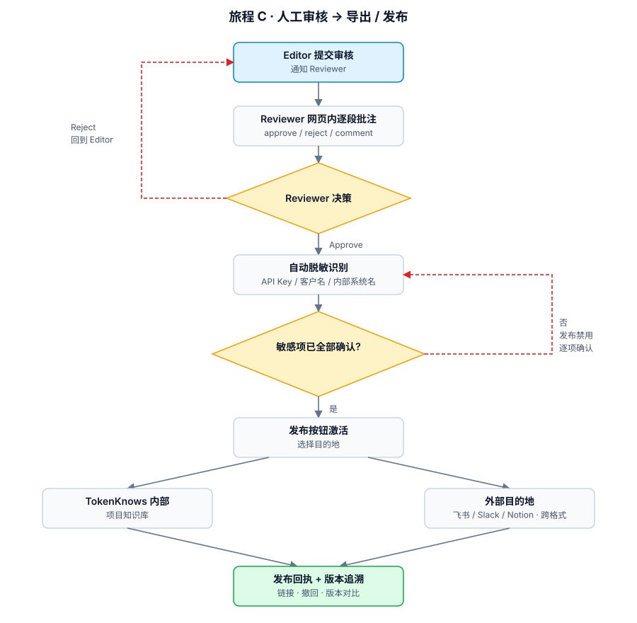
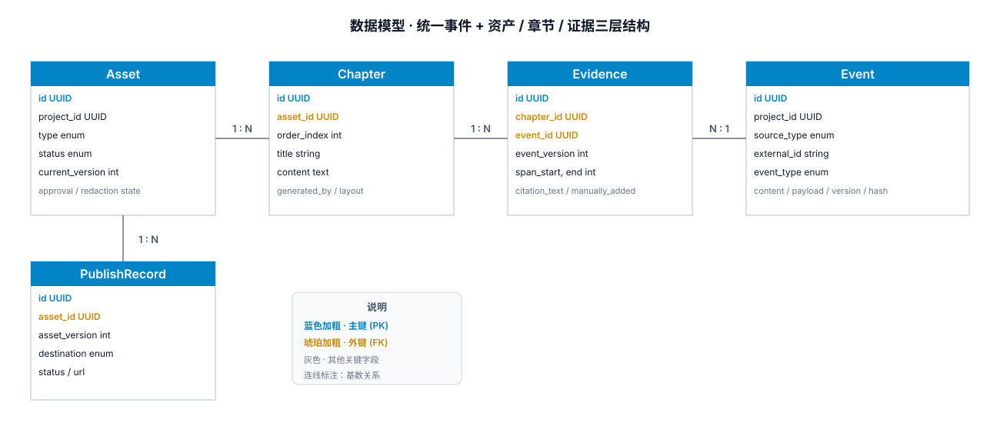

# PRD · TokenKnows MVP

> AI 研发知识资产引擎 — MVP 阶段产品需求文档

---

## 1. 文档信息

| 项目 | 内容 |
| --- | --- |
| 文档名称 | TokenKnows MVP 产品需求文档 |
| 文档版本 | v0.1（起草中） |
| 文档状态 | 起草中 · 章节逐步填充 |
| 撰写日期 | 2026-05-19 |
| 关联文档 | [BRD](./BRD_AI研发知识资产引擎.md) · TDD（待产出） · 设计稿（待产出） |
| 目标读者 | 产品、研发、设计、运营 |

### 1.1 MVP 关键决策

| # | 决策 | 备注 |
| --- | --- | --- |
| 1 | 采集方式 | Claude Code 插件 + Cursor 扩展 + VS Code 扩展（Copilot Chat），自动捕获会话（实际 Sprint 落地顺序见 §11 排期说明） |
| 2 | GitHub 接入 | 用户提供 PAT（最小只读权限） |
| 3 | 项目颗粒度 | 1 个项目 = 多仓库 + 多对话源 |
| 4 | 文档触发 | 手动 + 定时 + 事件触发，三种并存 |
| 5 | 角色模型 | Owner / Editor / Reviewer / Viewer |
| 6 | 部署形态 | **私有化优先 + 架构预留 SaaS**（详见 §6.5） |
| 6a | 部署目标 | Docker Compose 简易版（中小团队）+ K8s/Helm 企业版（中大型 IT）双方案 |
| 6b | LLM 接入 | 双模式：客户自带云端 API Key（Anthropic/OpenAI）/ 接入本地模型（Ollama、vLLM 等），由客户切换 |
| 7 | 身份认证 | 邮箱 + 密码（含邮箱验证、找回密码）；SSO 留作 Phase 2 |
| 8 | 脱敏策略 | 默认开启 + 用户必须确认才发布 |
| 9 | 试用策略 | **免费试点 3-5 家早期客户**，换案例与产品反馈；不发布公开免费版 |

### 1.2 体验要素索引

整份 PRD 在 §4 / §5 / §8 中频繁引用「要素 #N」。22 条要素简表如下（详细描述见对应模块）：

| # | 要素 | 主要出现位置 |
| --- | --- | --- |
| 1 | 注册即建空间（无中间页） | §4.1 |
| 2 | 私有化实例信息常驻顶栏 | §4.1 / §8.1 |
| 3 | 3 步内完成插件安装 | §4.1 / §5.1 A1 |
| 4 | 数据源添加向导（卡片状态可见） | §4.1 / §5.1 |
| 5 | 模板"推荐但不强制" | §4.1 |
| 6 | 实时研发事件流 | §4.2 / §8.1 |
| 7 | 阈值自动触发首份周报 | §4.2 / §5.3 C1 |
| 8 | 生成进度可视化（5 阶段） | §4.2 |
| 9 | 证据链一键查看（📎） | §4.2 / §5.4 D2 / §8.3 |
| 10 | 章节级重生成 / 修改要求 | §4.2 / §5.3 |
| 11 | 生成时可切换模型 | §4.2 / §5.3 / §6.6 |
| 12 | 文档自评卡 | §4.2 / §5.3 / §8.2 |
| 13 | 脱敏未确认 = 发布按钮禁用 | §4.3 / §5.6 F2 / §8.4 |
| 14 | Reviewer 网页内逐段审批 | §4.3 / §5.5 E2 / §8.4 |
| 15 | 外发目的地选择（飞书 / Slack / Notion） | §4.3 / §5.7 G2 |
| 16 | 发布回执 + 版本追溯 | §4.3 / §5.7 G2 |
| 17 | 失败回退路径显式可见 | §4.2 |
| 18 | 版式设计（成品级排版） | §4.2 / §5.7 G1 |
| 19 | 品牌主题系统（logo / 色板 / 字体） | §4.2 / §5.7 G1 |
| 20 | 段落级版式控制 | §4.2 / §5.5 E1 |
| 21 | 跨格式版式一致性 | §4.2 / §4.3 / §5.7 G1 |
| 22 | 打印 / 屏幕双优化 | §4.2 / §5.7 G1 |

> 关于编号体系：§1.1 决策表使用 1-9（含 6a、6b）；§5 模块内的"关联决策"引用形如 A.1 / C.1 / F.1，对应该模块内部的设计问题编号；本节 #1-#22 是体验要素编号，三套互不冲突。

---

## 2. 产品概述

### 2.1 产品定位与价值主张

TokenKnows 是面向 AI Native 研发团队的**知识资产操作系统**。它从研发过程的多个源头（Claude Code、Cursor、VS Code、GitHub）自动采集事件，识别其中的高价值内容，并将其沉淀为可追溯、可审计、可发布的项目文档与组织知识资产。

**价值主张三件套**

- **当天可见**：接入数据源后，事件累积到阈值即自动产出首份周报草稿，不用等"项目结束才写复盘"
- **可信可溯**：每段生成内容都能追溯到原始 PR / 对话 / 文件，证据链一键查看
- **私有可控**：默认零出域、私有化优先；客户决定 LLM 用云端还是本地

**与现有工具的差异化**

不是知识库问答（Glean）、不是文档协作（Notion AI）、不是 PR Review（CodeRabbit）。TokenKnows 解决的是**"AI 研发过程 → 组织资产"的完整链路**，覆盖采集、识别、生成、引用、脱敏、审批、发布七个环节。

### 2.2 MVP 范围

**In-scope**

- **数据源接入**：Claude Code 插件 / Cursor 扩展 / VS Code 扩展（Copilot Chat）/ GitHub（PAT 多仓）/ 本地文件
- **价值识别**：双层引擎（规则 + LLM），按 8 类标签分类
- **文档生成**：周报、技术方案、ADR、问题复盘共 4 类模板
- **证据链与来源追溯**：每段文本可回到原始事件
- **编辑与审批**：在线编辑、章节级版式、单级审批流
- **脱敏与合规**：双层识别、强制确认、敏感词清单可定制
- **导出与发布**：Markdown / Word / PDF 导出 + 飞书 / Slack / Notion 外发
- **部署形态**：Docker Compose 简易版 + K8s Helm 企业版，纯私有化
- **LLM 接入**：Anthropic / OpenAI / Ollama / vLLM 四适配器，客户可切换

**Out-of-scope**

- 完整企业搜索（不与 Glean / Rovo 竞争）
- 多级审批 / 复杂权限矩阵 / SSO（Phase 2+）
- SaaS 多租户（Phase 3）
- 完全自定义模板（用户只能改副标题，不能改大章节，Phase 2+）
- 出版社级排版（Phase 4）
- 完全自动发布（始终保留人工主编环节）
- 与 Jira / Linear 等工单系统的深度双向同步（Phase 2+）

### 2.3 目标用户

**MVP 试点客户画像**

| Persona | 角色 | 痛点 | 决策权 |
| --- | --- | --- | --- |
| Leo · AI 研发负责人 | 10-30 人 AI 研发团队的 Tech Lead / 总监 | 团队经验沉淀难、新人 onboarding 全靠口耳相传 | 自决，预算阈值 $5-50k/年 |
| Mia · Agent 项目负责人 | 技术咨询 / 企业创新部门 | 项目结束后方法论无法产品化 | 自决 + 业务老板，单项目预算 $10-100k |
| David · 技术布道 / 内容团队 | DevRel / 技术品牌 / 培训 | 内容生产周期长、依赖业务团队配合 | CMO 决策，年度预算 |

**项目内角色（呼应决策表 #5 四角色）**

- **Owner**：项目所有权与最终责任人。具体权限：
  - 创建项目 / 配置数据源
  - 指定与调整 Reviewer（含临时备用 Reviewer、接管在途审核）
  - 配置自定义敏感词清单及匹配优先级（§5.6）
  - 修改**项目级与任务级** LLM 出域开关（实例级开关属实例管理员，§6.7）
  - 解决用户标签冲突（§5.2 B2）
  - Reviewer 长期无响应时代行批准（§5.5 E2）
  - 审计访问
- **Editor**：日常生产（编辑文档 / 提交审核 / 加证据链）
- **Reviewer**：审核与脱敏确认
- **Viewer**：只读访问已发布资产

**实例层角色（私有化部署专属）**

- **实例管理员**：负责实例运维与跨项目策略。包括：部署 / 升级 / 备份 / 灾备 / **实例级出域开关**（§6.7.1）/ License 凭证管理 / SSO 配置（Phase 2）。可由首位 Owner 兼任，也可独立指派（典型为客户 IT 角色）。**实例级开关的修改权限仅在此角色**；项目 Owner 仅能在实例开关 ON 的前提下控制项目级 / 任务级开关。

---

## 3. 产品目标与度量

### 3.1 北极星指标

**周活项目数 × 项目内已发布资产数**

含义：一个项目"用得起来"（周活）+"沉淀下来"（发布资产数）的乘积；同时衡量产品的活跃度与价值产出，而非单纯流量。

**目标**：MVP 第 12 周末，3-5 家试点客户，整体北极星指标月环比 ≥ +30%。

### 3.2 关键产品指标

按 AARRR 维度拆分：

**Acquisition · 接入**

- 试点客户接入数：MVP 末期 3-5 家
- 首次接入时间（注册 → 第一个数据源连通）：P75 < 30 分钟

**Activation · 激活**

- 接入 → 首份文档生成时间：P75 < 24 小时
- 首份文档采纳率（被人工编辑或采用而非废弃）：≥ 70%

**Retention · 留存**

- 项目 7 日活跃率：≥ 60%
- 项目 30 日活跃率：≥ 80%
- 每项目每周生成文档数：≥ 2 份

**Quality · 质量**

- 文档人工修改率（**整体平均**，按 Chapter 字符 diff 占生成总字符比例）：< 40%
- 引用准确率（来源 span 匹配）：> 90%
- 脱敏识别准确率：> 95%
- 自评分覆盖度均值：> 70%

**Performance · 性能与可用性**

- 实时事件流端到端延迟 P95：< 5s
- 文档生成 P95：< 60s
- 实例可用性：≥ 99.5%

**Business · 商业**

- 试点 → 付费意向转化率：≥ 30%
- 月度文档发布数：≥ 20 份

### 3.3 MVP 验证假设

| 假设 | 验证方式 | 通过标准 |
| --- | --- | --- |
| AI 研发团队愿意把研发过程接入私有化产品 | 3-5 家完成部署 + 数据源接入 | 接入成功率 ≥ 80% |
| 自动生成的文档质量可用 | 试点客户**首份**生成文档的人工修改率（首份允许较宽，整体 KPI 见 §3.2） | < 50% |
| 双形态部署（Compose / K8s）合理 | 至少各 1 家上线 | Compose < 60 分钟、K8s < 1 周完成部署 |
| 双 LLM 模式（云端 / 本地）落地可行 | ≥ 1 家试点使用纯本地推理 | 本地模型自评分 ≥ 云端 80% |
| 用户愿意付费 | 试点结束时主动询问商业化 | ≥ 1-2 家提出付费合作 |
| 价值识别 + 证据链能"治"质量焦虑 | 用户对"质量差"的反馈次数 | 月环比下降 |

---

## 4. 核心用户旅程

> 本章用 mermaid 描绘端到端旅程，是后续功能需求的主线。

### 4.1 旅程 A · 首次接入与项目空间创建

**旅程目标**：用户在 5 分钟内完成"账号注册 → 项目创建 → 首个数据源接入"，并明确感知到自己连接的是哪台私有化实例。

**主要角色**：Owner（管理员 / 项目负责人）

**端到端流程**



**关键体验设计要点**

| 节点 | 设计要点 | 对应要素 |
| --- | --- | --- |
| 控制台顶栏 | 常驻显示当前实例地址、版本号、健康状态 | #2 |
| 注册成功页 | 无中间页，直接进入"创建第一个项目" | #1 |
| 项目创建 | 必填仅"项目名"，Owner 默认本人，模板可跳过 | #5 |
| 数据源选择 | 卡片视图，每张卡片显示连接状态（待配置 / 已连接 / 失败） | #4 |
| Claude Code 接入 | 3 步：下载链接 → 复制安装命令 → 连接 token 自动注入 | #3 |
| VS Code 接入 | 安装 TokenKnows VS Code 扩展，捕获 Copilot Chat 会话与文件变更 | #3 #4 |

**失败回退路径**

- 邮箱验证失败 → 重发邮件 + 显示发件历史
- 插件安装失败 → 提供诊断指引（端口连通、token 有效性、版本兼容）
- PAT 权限不足 → 显示最小所需权限清单（`repo:read`、`pull_requests:read`、`issues:read`），允许局部回退到"只接入 Issues"
- 数据源连接超时 → 卡片状态变为"失败"并展开错误详情，不阻断其他源接入

### 4.2 旅程 B · 单项目"过程 → 资产"完整链路

**旅程目标**：用户接入数据当天看到第一份自动生成的文档，并且对"质量从哪里来、如何调整"具有完全掌控感（直接呼应决策表中最大担忧——生成质量差）。

**主要角色**：Editor（研发 / PM / Tech Lead）

**端到端流程**



**关键体验设计要点**

| 节点 | 设计要点 | 对应要素 |
| --- | --- | --- |
| 工作台首屏 | 实时事件流，PR / Commit / 对话流入即可见 | #6 |
| 首份生成触发 | 事件累积到阈值自动触发，目标"接入当天看到价值" | #7 |
| 生成过程 | 5 阶段进度条，每阶段可点击查看中间产物 | #8 |
| 文档呈现 | 套用项目品牌主题（logo / 色板 / 字体），不是 plain markdown | #18 #19 |
| 段落级版式 | 用户可对单段调整样式（callout / 警告 / 引用） | #20 |
| 跨格式一致性 | Markdown / Word / PDF 三种导出视觉对齐，打印与屏幕双优化 | #21 #22 |
| 模型切换 | 章节级 UI 显示当前模型，可一键换 Claude / GPT / 本地模型重生 | #11 |
| 证据链 | 每段标注「📎N 条来源」，点击展开原始 PR / 对话片段 | #9 |
| 章节级重生 | "重写此段"支持自然语言指令（如"再具体点 / 加风险点"） | #10 |
| 自评卡 | 自动给出"覆盖度 / 引用密度 / 空话比例 / 与历史文档相似度" | #12 |

**失败回退路径**（核心：缓解"生成质量差"风险，对应要素 #17）

- 用户不满意 → 三条主路径：**章节重生成 / 手动编辑 / 放弃此文档**
- 模型不可用 → 自动 fallback 至备用模型，UI 显式提示"由 X 模型生成"
- 数据源断连 → 不阻塞生成，用已有数据出稿；工作台头部显示告警 + 重连入口
- 自评分过低（如覆盖度 < 60%）→ 系统主动建议"补充数据源后再生成"，避免低质量输出

### 4.3 旅程 C · 人工审核 → 导出 / 发布

**旅程目标**：Reviewer 在网页内完成所有审核与脱敏确认，发布过程零外部工具切换；跨目的地保持版式一致。

**主要角色**：Reviewer + Owner

**端到端流程**



**关键体验设计要点**

| 节点 | 设计要点 | 对应要素 |
| --- | --- | --- |
| Reviewer 工作面 | 逐段批注 / approve / reject / comment，无需切到外部工具 | #14 |
| 脱敏门禁 | 未确认敏感项时发布按钮禁用，悬浮提示"还有 N 处未确认" | #13 |
| 脱敏建议 | 系统给出脱敏后预览，用户一键应用或局部覆盖 | #13 |
| 发布目的地 | 飞书 / Slack / Notion 卡片选择，可"记住选择" | #15 |
| 发布粒度 | 可选"完整文档"或"摘要 + 回链 TokenKnows" | #15 |
| 跨格式一致 | 导出 MD / Word / PDF / 外发到目的地，视觉对齐 | #21 |
| 发布回执 | 显示分享链接、已发送目的地清单、支持撤回 | #16 |

**失败回退路径**

- Reviewer 长时间无响应 → 系统自动催办 + Owner 可指派备用 Reviewer
- 外部目的地发布失败 → 显示失败原因，支持重试，不影响其他目的地
- 已发布需撤回 → 支持发起撤回流程，并在版本历史中标记"已撤回"
- 脱敏识别误报 → 用户可"标记为非敏感"，下次同类内容跳过

---

## 5. 功能需求

> 每个功能：用户故事 + Given/When/Then 验收标准 + 优先级 + 异常分支

### 5.1 模块 A · 数据源接入

#### A1 Claude Code 插件采集

**用户故事**：作为 Editor，我希望 Claude Code 中的对话和工具调用自动同步到 TokenKnows，不需要手动复制粘贴。

**验收标准**

- Given 用户已登录 TokenKnows，并下载安装 Claude Code 插件 / 注入连接 token
  When 用户启动 Claude Code 并开始对话
  Then 插件后台监听会话事件，将 prompt / response / 工具调用日志（tool use、file read、bash command）实时推送到当前项目

- Given 网络中断或服务端不可达
  When 插件继续运行
  Then 数据缓存到本地 ring buffer（默认 100MB / 7 天），网络恢复后增量补传，按事件 ID 去重

- Given 用户切换项目或暂停采集
  When 在插件 UI 选择"切换项目"或"暂停"
  Then 当前事件流停止，已缓存数据保留

**优先级**：P0

**异常分支**

- 插件版本与服务端不兼容 → 阻断采集 + 弹窗提示升级，避免数据格式错乱
- 连接 token 失效 → 提示重新认证，本地缓存保留
- 单条事件超过 1MB → 截断 + 标记"已截断"，保留首尾 + 中间摘要

**关联决策**：A.1 含工具调用日志、A.2 实时增量 + 本地缓冲

#### A2 Cursor 扩展采集

**用户故事**：作为 Editor，我希望 Cursor 编辑器中的 AI 对话与代码变更自动同步到 TokenKnows。

**验收标准**

- Given 用户安装 TokenKnows Cursor 扩展并完成连接
  When 用户在 Cursor 中使用 chat 或 inline 编辑
  Then 扩展捕获 chat 上下文（prompt + 回复）、文件 diff 和触发的 agent 任务，推送到对应项目

- Given Cursor 切换到不同工作区
  When 工作区路径变化
  Then 扩展按"工作区路径 → 项目"映射自动切换，无需手动操作

**优先级**：P0

**异常分支**

- Cursor 关闭了 chat 历史持久化 → 检测后提示用户开启；否则仅采集当前 session 数据
- 多窗口同时编辑 → 按窗口 id 区分会话，避免跨窗口合并错乱
- 工作区未映射到任何项目 → 在状态栏标注"未关联项目"，事件暂存不丢

**关联决策**：A.1 含工具调用、A.4 多源跨项目映射

#### A3 VS Code 扩展采集（Copilot Chat 会话）

**用户故事**：作为 Editor，我希望 VS Code 中 GitHub Copilot Chat 的会话被自动捕获，并和文件变更关联。

**验收标准**

- Given 用户安装 TokenKnows VS Code 扩展并连接到项目
  When 用户在 Copilot Chat 中发起对话
  Then 扩展从 Copilot Chat API（或本地日志路径）读取 prompt / response / 引用文件，推送到项目

- Given 用户在 Chat 中"接受"了 Copilot 的代码修改建议
  When 修改被应用到文件
  Then 扩展把对话片段与"被修改的文件 + diff"关联，作为一个研发事件保存

**优先级**：P0

**异常分支**

- Copilot 升级导致 API 接口变化 → 回退到"剪贴板复制 + 手动绑定到项目"的兜底路径
- 用户未启用 Copilot Chat → 扩展仅采集文件变更，不阻断；状态栏提示"AI 会话未捕获"
- 同时安装了 Cursor / Cline → 互不冲突，按宿主进程区分

**关联决策**：A.1 含工具调用类比（采纳建议作为事件）、A.2 实时增量

#### A4 GitHub PR / Issue / Commit 接入（PAT）

**用户故事**：作为 Owner，我希望用一个 PAT 把多个 GitHub 仓库的 PR / Issue / Commit 同步到 TokenKnows。

**验收标准**

- Given Owner 在"数据源"页选择 GitHub 卡片
  When 输入 PAT 并多选要接入的仓库
  Then 系统验证 PAT 权限（必须包含 `repo:read`、`pull_requests:read`、`issues:read`），并启动首次全量同步（默认最近 90 天）

- Given 全量同步完成
  When 时间推进
  Then 系统通过 webhook + 增量轮询保持事件流更新（PR 创建/合并/评论、Issue 状态变更、Commit push、Review）

- Given 用户给同一项目挂了多个 GitHub 仓库
  When 仓库都开始产生事件
  Then 工作台事件流按时间归并，每条事件明确标注来源仓库与分支

**优先级**：P0

**异常分支**

- PAT 权限不足 → 列出缺失权限项；支持"只接入 Issues"的局部降级
- PAT 过期 → 项目所有 GitHub 源标记为"鉴权失效"，工作台显式提示并保留旧数据
- GitHub API 限流 → 自动退避重试，必要时切换 webhook + 全量轮询并行模式
- 仓库被删除 / 归档 → 标注"归档"，停止增量同步，已采集数据保留

**关联决策**：A.3 单 PAT 多仓、A.4 跨项目复用

#### A5 本地文件上传

**用户故事**：作为 Editor，我希望把本地的 Markdown 笔记、会议纪要、PDF 设计稿等手动上传到项目，作为补充语料。

**验收标准**

- Given 用户在"数据源"页选择"本地文件"
  When 拖拽或选择文件（支持 `.md` / `.txt` / `.docx` / `.pdf` / `.json`）
  Then 系统接收文件，做基础解析（提取文本、保留章节结构、提取图片 alt），作为"手动事件"接入流

- Given 单文件超过 50MB
  When 上传
  Then 系统提示"超过单文件上限，请拆分"并拒绝接收

**优先级**：P1

**异常分支**

- 加密 PDF / Word → 提示"需要先解锁"
- 文件编码识别失败 → 弹出编码选择（UTF-8 / GBK / Shift-JIS）
- 重复上传同名文件 → 询问"替换 / 保留两份 / 取消"

**关联决策**：BRD §10.2 MVP 必做项

### 5.2 模块 B · 高价值内容识别

#### B1 价值片段抽取

**用户故事**：作为 Editor，我希望系统自动从原始事件中识别出"高价值片段"（架构决策、Bug 根因、Prompt 模式、技术方案等），让后续生成有据可依。

**验收标准**

- Given 数据源持续接入项目，事件流入主表
  When 价值识别流水线运行（在线增量 + 批量回扫）
  Then 系统对每条事件按段切分，分类为 `architecture_decision / bug_rca / prompt_pattern / tech_design / performance / security / ux_feedback / other` 之一，并产出 `ValueSegment(event_id, span, category, trust_score, category_confidence)`

- Given 一条事件包含多个价值点
  When 抽取运行
  Then 拆为多个 ValueSegment，各自指向原事件中的字符 span

- Given 用户标记某段为"误识别"或"未识别但应识别"
  When 标记
  Then 记录到反馈表用于后续模型微调；在本项目内立即影响 trust_score 排序

**优先级**：P0

**异常分支**

- 抽取流水线某条事件处理失败（LLM 异常）→ 标记 `extraction_state=failed`，按指数退避重试，不阻塞下游
- 超长事件（> 50k 字符）→ 分块抽取后合并 ValueSegment
- 中英混排或多语 → 使用多语 prompt；保留原文语言标签

**关联决策**：F.1 双层引擎（规则 + LLM）、C.3 用户手选模型

#### B2 可信度评分

**用户故事**：作为 Editor，我希望对每段被识别为高价值的内容看到清晰的"可信度"指标，以便快速判断是否采纳。

**验收标准**

- Given 一个 ValueSegment 被抽取
  When `trust_score` 计算
  Then 由以下因素加权得出（公式可文档化）：
    - `source_authority`：PR 已合并 ＞ Issue 已关闭 ＞ 设计讨论 ＞ 随手聊天
    - `corroboration`：被多少个独立来源印证
    - `recency`：时间衰减
    - `extraction_confidence`：模型自评

- Given Chapter 通过 Evidence 引用了多个 ValueSegment
  When Chapter 生成完成
  Then 每条 Evidence 派生 `citation_strength`；Chapter 整体 `coverage / citation_density` 进入自评卡（呼应 §4.2 #12）

- Given 用户手工标记可信度
  When 标记
  Then `manual_trust_override` 写入；后续生成与排序优先采纳人工标签

**优先级**：P0

**异常分支**

- 部分输入信号缺失（如未关联到 PR） → 回退到仅 `source_authority` 计算，UI 标"信号有限"
- 多个用户标签矛盾 → 按角色优先级解决（Owner > Reviewer > Editor），UI 展示分歧

**关联决策**：C.4 低质量出稿 + 标红、要素 #12 自评卡

### 5.3 模块 C · 文档自动生成

#### C1 项目周报

**用户故事**：作为 Editor，我希望 TokenKnows 每周自动生成一份周报，包含本周进展、Bug、决策、风险与下周计划。

**验收标准**

- Given 项目数据源已接入，且本周累积事件 ≥ 20 或合并 ≥ 1 个 PR
  When 周一上午 9:00（项目时区，可在项目设置中配置）
  Then 系统自动生成上周周报草稿，按"进展摘要 / Bug 与解决 / 关键决策 / 风险与阻塞 / 下周计划"五段输出，每段标注证据链

- Given 用户在生成结果页
  When 点击章节"重生成"或输入自然语言修改要求（如"再详细一点 / 加上风险预案"）
  Then 仅重生成该章节，其他章节保持不动

- Given 用户希望手动触发生成
  When 选择时间窗（默认上周）+ 数据源（默认全部）
  Then 系统按所选范围生成

**优先级**：P0

**异常分支**

- 时间窗内事件 < 5 → 输出"事件较少"占位段 + 提示用户检查数据源
- 自评分覆盖度 < 60% → 文档标红警告 + 建议补充数据源（不阻断）
- 多个 PR 反复撤回 / 重开 → "研发动态"按最终状态显示，备注变更历史
- 模型不可用 → 自动 fallback 到备用模型并显式标注"由 X 模型生成"

**关联决策**：C.1 内置模板 + 副标题可改、C.2 自动 + 用户可覆盖、C.3 用户手选模型、C.4 低质量出稿 + 标红

#### C2 技术方案

**用户故事**：作为 Tech Lead，我希望基于一段时间内的设计讨论、Prompt 迭代、架构决策，自动整理出一份完整的技术方案文档。

**验收标准**

- Given 项目内存在足够的方案讨论事件（聊天、Prompt 迭代、ADR 草稿、PR 描述）
  When 用户在"文档"页选择"新建技术方案"并设置范围（时间窗 + 主题关键词）
  Then 系统按"背景 / 目标 / 设计思路 / 关键决策 / 风险与取舍 / 实施计划"六部分生成草稿

- Given 用户对某章节不满意
  When 输入"再具体一点，加上数据流图"
  Then 系统在该章节内重生成，并尝试用 Mermaid / ASCII 图 / 文字补充数据流

- Given 用户在文档中标记某段为"需要人工补充"
  When 系统重生成
  Then 该段不被覆盖

**优先级**：P0

**异常分支**

- 范围内事件过于分散、识别不出明确主题 → 提示"主题不明确，请缩小关键词或时间窗"
- 代码片段超过 200 行 → 自动折叠为"展开/收起"段，并在 PDF 导出时拆页
- 用户引用了无访问权限的 GitHub 仓库 → 该来源处显示"无访问权限"并跳过

**关联决策**：C.1 内置模板、C.3 用户手选模型、C.4 标红警告

#### C3 ADR 架构决策记录

**用户故事**：作为 Tech Lead，我希望把项目中的关键技术决策（如选用 PostgreSQL 还是 MongoDB）自动整理为 ADR。

**验收标准**

- Given 项目中存在被识别为"架构决策"的事件（关键 PR 描述、设计讨论、方案对比）
  When 系统每日自动扫描或用户手动触发"扫描 ADR 候选"
  Then 系统列出候选清单（决策标题 + 时间 + 涉及事件数 + 推测状态），用户勾选要生成的项

- Given 用户确认某项决策
  When 选择"生成 ADR"
  Then 系统按"上下文 / 决策内容 / 备选方案 / 后果 / 状态（提议 / 已决 / 废弃）"五部分生成草稿

- Given 已有 ADR 被后续事件推翻或更新
  When 关联事件再次触发架构决策识别
  Then 系统在该 ADR 标签上加"被取代"，并提示用户更新

**优先级**：P0

**异常分支**

- 决策识别错杀（把日常讨论当决策） → 用户可"标记为非决策"，反馈给识别模型
- 一项决策跨度极长（≥ 60 天且反复讨论） → ADR 内自动按时间分段表达
- 同一决策被识别为多个候选 → 系统提示"疑似重复"，建议合并

**关联决策**：C.1 内置模板、C.4 标红警告

#### C4 问题复盘报告

**用户故事**：作为 Editor，我希望把项目中的 Bug、故障、性能问题自动整理为可复用的复盘报告。

**验收标准**

- Given 项目内有被识别为"问题事件"的内容（Bug Issue、含 fix/bug 关键词的 PR、故障讨论）
  When 用户选择"生成问题复盘"
  Then 系统按"现象 / 影响范围 / 根因 / 解决过程 / 改进措施 / 时间线"六部分生成

- Given 单个复盘对应多个相关 PR / Issue
  When 生成
  Then 系统在"时间线"自动构建事件顺序，并按时间锚点展示

**优先级**：P0

**异常分支**

- 根因在原始事件中未提及 → 在"根因"段落标注"待补充"并提示人工填写
- 同一 Bug 在多次复盘中反复出现 → 系统提示"高频问题"，建议合并为系统性复盘
- 改进措施被识别为"未跟进" → 在 ADR / 后续周报中提醒

**关联决策**：C.1 内置模板、C.4 标红警告

### 5.4 模块 D · 证据链与来源追溯

#### D1 片段 ↔ 原始事件绑定

**用户故事**：作为 Editor，我希望生成文档中的每一段都能反向追溯到原始事件，便于验证内容真实性。

**验收标准**

- Given Chapter 由 LLM 生成
  When 生成完成
  Then 系统按段落（或更细的子段）创建 Evidence 记录，链接到 prompt 上下文中真正用到的 ValueSegment / Event；生成 prompt 要求模型以结构化输出标注"哪些来源支持哪段输出"

- Given 用户手工编辑了一段已有引用的内容
  When 编辑影响该 span
  Then 系统按内容相似度判定：
    - 字符相似 ≥ 70% → 保留 Evidence
    - 30%-70% → 标记为 `stale`，UI 黄色提示
    - < 30% 或删除 → 移除 Evidence

- Given 某段落零引用
  When Chapter 渲染或审核时
  Then UI 显式提示"未引用来源"，并建议"手动加来源"或"重写此段"

**优先级**：P0

**异常分支**

- LLM 未返回结构化引用 → 回退到启发式映射（TF-IDF / 向量相似度匹配输出段与输入片段）
- 单段引用 > 20 条 → 保留 trust_score 最高的 10 条，"+N more"折叠
- Evidence 指向的事件已被脱敏 → 在审核阶段以 `[REDACTED 来源]` 占位；仅 Reviewer / Owner 可临时展开查看

**关联决策**：要素 #9 证据链查看、F.4 脱敏权限隔离

#### D2 证据查看面板

**用户故事**：作为 Reviewer 或 Editor，我希望点击任意段落的「📎 来源」就能看到支撑这段的原始 PR / 对话 / 文件内容。

**验收标准**

- Given Chapter 渲染中含 Evidence
  When 用户点击「📎 N 条来源」徽章
  Then 右侧抽屉滑出，展示：
    - 每条来源的 title / source_type / author / occurred_at
    - 原始内容片段，被引用 span 高亮
    - "在工作台事件流中查看"跳转
    - trust_score 与 citation_strength

- Given 用户希望"在源头打开"（如原始 GitHub PR）
  When 点击外链
  Then 新标签页打开外部 URL；本地文件来源则显示文件路径

- Given Evidence 来自被脱敏的事件
  When 非 Reviewer 角色查看
  Then 内容片段保持遮蔽；Reviewer / Owner 可"临时展开原文"，展开行为入审计

**优先级**：P0

**异常分支**

- 源事件已被管理员强制物删 → 显示"来源已删除"，保留最后已知 metadata
- 多条 Evidence 指向重叠 span → 按 Event 分组，可折叠展开
- 来源内容过大 → 默认预览前 500 字，"展开"按钮加载全文

**关联决策**：要素 #9 一键证据查看、§6.2 权限隔离

### 5.5 模块 E · 人工编辑与审批

#### E1 文档编辑器

**用户故事**：作为 Editor，我希望在网页内直接对 AI 生成的草稿做精修，同时保留证据链与版本历史。

**验收标准**

- Given Chapter 已生成并在编辑器中呈现
  When Editor 修改文本（输入 / 删除 / 改格式）
  Then 字符级 diff 记录；每 5 秒自动保存；编辑后 Evidence 按 D1 规则保留 / 标 stale / 移除

- Given Editor 对某段套用版式（callout / 警告 / 引用 / 代码块）
  When 选中段落选择样式
  Then `Chapter.layout` 更新；该样式在所有导出格式中保持一致（呼应 §6.4 跨格式一致 / 要素 #21）

- Given Editor 希望手动加一条 Evidence
  When 选中 span 点击"+ 来源"
  Then 弹出事件搜索框，可从事件流中检索并绑定

- Given 多人同时打开同一 Chapter
  When 同时编辑
  Then 章节级锁定（同一时刻只有一个 Editor 真编辑），其他人只读 + 显示"X 正在编辑"指示

**优先级**：P0

**异常分支**

- 网络中断 → 进入"离线编辑"模式，本地缓存修改，重连后冲突合并
- 保存失败 → 通知用户，浏览器保留未保存内容
- Chapter 在编辑过程中被他人改过 → 弹出 diff 对话框，用户选择"合并 / 覆盖 / 放弃"

**关联决策**：要素 #14 在线审批、#20 段落级版式、#21 跨格式一致

#### E2 单级审批流

**用户故事**：作为 Owner，我希望为项目配置 Reviewer，并设置一套简单的单级审批流，文档必须经过审批才能发布。

**验收标准**

- Given Owner 在项目设置中指派 ≥ 1 名 Reviewer
  When 配置完成
  Then 该项目下所有 Asset 的"发布"动作必须通过 Reviewer 审批

- Given Editor 提交 Asset 审核
  When 提交
  Then Asset 状态 → `in_review`；系统通过站内通知 + 邮件通知所有 Reviewer；Reviewer 可对每个 Chapter 单独 approve / reject / comment

- Given Reviewer 驳回某段或整篇
  When 提交驳回 + 评论
  Then Asset 状态 → `draft`；Editor 看到驳回评论 inline 展示；进入下一轮迭代

- Given 所有 Chapter 已 approved 且所有脱敏项已确认（呼应 §F2）
  When 状态满足
  Then "发布"按钮激活

**优先级**：P0

**异常分支**

- 全部 Reviewer ≥ 48 小时无响应 → Owner 可"代行批准"，审计日志强制记录 + 邮件告知所有 Reviewer
- Reviewer 离开项目 → 在途审核回退给 Owner；可指派备用
- 审批通过后 Asset 又被改动且新增敏感项 → 仅对改动段重新触发审批，已通过段不重审
- 审批中 Asset 被删除 → 通知所有相关 Reviewer + Editor，停止在途流程

**关联决策**：要素 #14 / 角色模型 O/E/R/V

### 5.6 模块 F · 脱敏与合规

#### F1 敏感信息自动识别

**用户故事**：作为 Reviewer，我希望在发布文档前看到所有敏感信息被标红，并能逐项确认或修改。

**验收标准**

- Given 文档生成完成或进入审核流
  When 系统启动脱敏检查
  Then 双层引擎并行运行：
    - **规则层**匹配高确定性敏感项（API Key、URL、Token、邮箱、IP、信用卡格式、企业域名）
    - **LLM 层**做语义判断（客户名、内部系统名、未发布功能、商业机密短语）
  每处在文档中标红，显示"敏感类型 + 建议替换值 + 来源置信度"

- Given 项目 Owner 配置了"项目级自定义敏感词清单"
  When 识别引擎运行
  Then 自定义清单与内置清单合并，按 Owner 设置的优先级处理；命中自定义项的优先级最高

- Given 用户认为某处识别为误报
  When 点击"标记为非敏感"
  Then 该处取消标红，记录到本项目的"已豁免清单"，下次同类内容自动跳过

**优先级**：P0

**异常分支**

- LLM 不可用（私有化场景下本地模型挂了） → 降级为仅规则层；UI 显式提示"部分语义敏感项未识别，请人工审查"
- 自定义敏感词为正则表达式且写错 → 保存前校验，错误时拒绝保存并定位错误位置
- 大文档（> 50k 字）识别超时 → 自动分段处理并显示进度
- 私有化场景且关闭了出域 → 自动启用本地小模型做 LLM 层（性能略降但不阻断）

**关联决策**：F.1 双层引擎、F.2 自定义清单、F.4 插件端粗筛 + 服务端精细识别

#### F2 脱敏建议与一键应用

**用户故事**：作为 Reviewer，我希望一键应用所有脱敏建议，但保留对每一处单独覆盖的能力。

**验收标准**

- Given 文档识别出 N 处敏感项
  When 用户点击"一键应用建议"
  Then 所有敏感项替换为类型化占位符（`[CUSTOMER]`、`[API_KEY]`、`[INTERNAL_SYSTEM]` 等），所有项状态从"待确认"变为"已确认"

- Given 用户希望某处替换为自定义文本（如把 `[CUSTOMER]` 改为"某金融客户"）
  When 用户在该处编辑占位
  Then 系统允许覆盖默认占位，并在悬浮提示中保留"原始内容"供 Reviewer 审查（仅 Reviewer / Owner 可见）

- Given 所有敏感项已被确认（无论应用建议、自定义覆盖、还是标记为非敏感）
  When 用户尝试发布
  Then "发布"按钮激活；否则发布按钮禁用，悬浮提示"还有 N 处未确认"（呼应旅程 C #13）

**优先级**：P0

**异常分支**

- 用户撤销脱敏 → 支持最近 N 步（默认 20）撤销
- 应用建议后版式遭到破坏（如句子断裂） → 系统自动调整周围空格 / 标点，并提示"已自动微调，请检查"
- 同一占位符在文档中多次出现 → 一次覆盖应用到全文（可选）
- 用户在已发布文档上发起脱敏修订 → 触发"版本追溯"，新版本独立编号

**关联决策**：F.3 类型化占位符、F.4 用户确认门禁

### 5.7 模块 G · 导出与发布

#### G1 Markdown / Word / PDF 导出

**用户故事**：作为 Editor 或 Reviewer，我希望把已批准的文档导出为 Markdown / Word / PDF 三种格式，且视觉一致。

**验收标准**

- Given Asset 状态为 `approved` 或 `published`
  When 用户选择"导出"并选格式（md / docx / pdf）
  Then 系统按项目品牌主题（logo / 色板 / 字体，呼应要素 #19）生成；导出产物落对象存储，TTL 默认 90 天；UI 返回下载链接

- Given 用户选 PDF
  When 生成
  Then 文件包含：封面（标题、项目、版本、生成时间）、目录 + 页码、页眉页脚（项目 + 第 X / Y 页）；章节边界尊重分页

- Given 用户选 docx
  When 生成
  Then 应用结构化样式（Heading 1-4、callout、代码块、表格）；与屏幕渲染视觉一致（呼应 §6.4）

**优先级**：P0

**异常分支**

- 品牌字体加载失败 → 回退系统字体；UI 提示"品牌资源不可用，已使用默认样式"
- Asset 版本与请求时不一致（导出过程中草稿变更） → 询问用户"导出当前草稿 / 导出上次已发布版本"
- 大文件（> 100MB） → 服务端流式生成 + 下载进度 UI；过大时触发服务端切片

**关联决策**：要素 #18 / #19 / #21 / #22

#### G2 链接分享与剪贴板（外发到外部目的地）

**用户故事**：作为 Reviewer，我希望一键把已批准的文档发布到飞书 / Slack / Notion，并可选择"完整文档"或"摘要 + 回链"。

**验收标准**

- Given Asset 已批准且脱敏全部确认
  When 用户点击"发布"并多选目的地（飞书 / Slack / Notion / 内部知识库）
  Then 对每个目的地：
    - 用户选"完整文档"或"摘要 + 回链 TokenKnows"
    - 系统调用预配置的目的地凭证（实例级或项目级）
    - 推送内容、捕获目的地 URL
    - 创建 PublishRecord（status / url / published_at）

- Given 用户上次已发布到某目的地
  When 再次打开发布对话框
  Then 默认勾选上次目的地与模式（呼应要素 #15 "记住选择"）

- Given 用户想撤回某次发布
  When 在 PublishRecord 上点击"撤回"
  Then 系统调用目的地删除 API（或标记撤回，取决于目的地能力）；PublishRecord.status → `revoked`；版本历史保留

**优先级**：P0

**异常分支**

- 目的地凭证过期 / 被删除 → 该目的地发布失败并提示"凭证失效"；其他目的地继续
- 目的地 API 不可用 → 标 `failed` + 指数退避重试队列
- 目的地不支持富格式（如 Slack 表格弱） → 自动降级为简化渲染 + 明确"完整版本回链"
- 已发布文档再次发布到同一目的地 → 弹窗"覆盖原文档 / 新建版本"由用户选择

**关联决策**：要素 #15 目的地选择、#16 发布回执 + 版本追溯

---

## 6. 非功能性需求

### 6.1 性能

**目标**：MVP 阶段单实例支持 50 并发用户、单项目 1M 事件、生成体验"等得起、看得见"。

**需求**

| 维度 | 指标 | 优先级 |
| --- | --- | --- |
| 工作台首屏加载 | P95 < 2s | P0 |
| 实时事件流端到端延迟（插件 → 工作台显示） | P95 < 5s | P0 |
| 单份文档生成（中等长度 ~2000 字） | P95 < 60s，P99 < 120s | P0 |
| 并发生成 | 单实例并发 ≥ 10 个文档生成任务 | P0 |
| 大文档渲染（≥ 10k 字） | 流式渲染，首字 < 3s | P1 |
| 搜索 / 过滤事件流 | P95 < 500ms | P1 |

**实现要点**

- 生成任务全程异步，进度通过 SSE 推送
- 事件流通过消息队列（NATS / Redis Stream）解耦
- 数据库索引按 `project_id + event_time` 复合索引，避免大表全扫
- LLM 调用流式响应，避免长阻塞

**验收方式**

- 提供 k6 性能压测脚本，每次发布前在标准压测环境跑一次
- 关键路径埋点 + Prometheus 监控面板（见 §6.3）

### 6.2 安全与隐私

**目标**：满足试点客户（含金融、Web3、能源等高合规行业）对企业级安全的基础要求。

**需求**

- **传输加密**：所有 HTTP 走 HTTPS / TLS 1.2+，禁用弱密码套件
- **静态加密**：数据库与对象存储默认 AES-256 加密；敏感字段（密码、PAT、LLM API Key、连接 token）使用 vault 二次加密
- **密码策略**：Argon2id 哈希；强度策略（≥ 10 位、含字母+数字+符号）；登录失败 5 次锁定 15 分钟；可选 TOTP（Phase 2）
- **PAT / API Key 管理**：仅在使用瞬间解密，UI 中始终显示掩码，支持轮换与撤销
- **审计日志**：所有写操作（含数据源增删、模型切换、敏感操作、发布、撤回）记录 `who / when / what / before / after`，保留 ≥ 90 天
- **二次确认**：敏感操作必须二次确认——数据源删除、外部发布、修改 LLM 出域开关、修改自定义敏感词清单
- **软删除**：文档与已采集事件支持 90 天软删（管理员可强制物删）
- **CSRF / XSS / SQLi**：通过框架默认防护 + 输入校验 + 输出转义
- **依赖漏洞**：CI 阶段强制 SCA 扫描（Snyk / Trivy）；高危 CVE 阻塞发布

**验收方式**

- 渗透测试基线：OWASP Top 10 全部通过
- 安全扫描报告随版本发布（依赖漏洞 + 静态代码扫描 + 镜像扫描）

### 6.3 可观测性

**目标**：故障定位时间 < 15 分钟；关键业务指标对运营 / 客户 / 自身研发同时可见。

**需求**

- **结构化日志**：JSON 格式，必带字段 `ts / level / project_id / user_id / trace_id / event`；私有化默认输出到本地文件 + 可选接 Loki / ELK
- **指标接口**：Prometheus 兼容 `/metrics` 端点
- **链路追踪**：OpenTelemetry，跨服务（Web / Worker / LLM 网关）打通
- **健康检查**：`/healthz`（存活）+ `/readyz`（就绪），K8s probe 友好
- **业务埋点**：
  - 数据接入：每数据源采集成功率、事件总数、延迟分布
  - 文档生成：生成时延、模型耗时、Token 用量、自评分布、人工修改率
  - 发布：发布数、按目的地分布、撤回率
  - 脱敏：识别命中数、误报率（用户标记非敏感的占比）
- **故障告警模板**：随产品出，覆盖采集断连、生成超时、LLM 异常、磁盘 / DB 健康

**验收方式**

- 提供 Grafana 模板面板（一份运维 + 一份业务）
- 提供 Prometheus alert rules 模板

### 6.4 兼容性

**目标**：覆盖主流开发者环境，不强求长尾。

**需求**

| 维度 | 范围 |
| --- | --- |
| 浏览器 | Chrome / Edge / Firefox / Safari 最近 2 年版本；移动端阅读优化（不强求编辑） |
| 操作系统 | 插件 / 扩展：macOS 12+、Windows 10+、Linux（Ubuntu 20+、RHEL 8+） |
| IDE 版本 | Claude Code 最新版；Cursor ≥ 0.40；VS Code ≥ 1.85 |
| 文件格式（导入） | `.md` `.txt` `.docx` `.pdf` `.json` |
| 文件格式（导出） | `.md` `.docx` `.pdf`；跨格式视觉一致（呼应要素 #21） |
| 数据库 | Postgres 14+（私有化推荐 15）；Docker Compose 默认内置 Postgres 15 |
| 对象存储 | S3 兼容（含 MinIO、Ceph、阿里云 OSS、腾讯云 COS） |
| 国际化 | MVP：中英双语 UI；文档生成支持中 / 英；Phase 2 加日韩 |

**实现要点**

- Web 端编译目标 ES2020
- 字体回退到系统字体，避免品牌字体加载失败导致渲染异常

### 6.5 部署与交付（私有化重点）

**目标**：让中小团队 30 分钟自助上手，让企业 IT 按标准 K8s 流程接入；同一份代码、两种部署形态。

#### 6.5.1 双形态部署

| 形态 | 适用对象 | 部署方式 | 依赖 |
| --- | --- | --- | --- |
| **Compose 简易版** | 中小团队、PoC、个人试点 | `docker compose up -d` | 内置 Postgres 15 + Redis 7 + MinIO；单机即可运行 |
| **K8s 企业版** | 中大型企业 IT | Helm Chart（`helm install tokenknows ...`） | 外置 Postgres / Redis / S3 兼容存储；支持 HA 多副本与水平扩展 |

**约束**：业务代码完全一致；两种形态的差异**只**通过环境变量 + Helm values 体现。禁止在代码里硬编码"是否私有化"分支。

#### 6.5.2 离线安装

- 提供 `tokenknows-offline-vX.Y.Z.tar.gz`，包含所有 Docker 镜像 + Helm Chart + 安装脚本 + 离线文档
- 安装脚本支持自动 `docker load` 与镜像私服推送
- 包大小目标：MVP 阶段 < 4GB

#### 6.5.3 升级机制

- 版本号遵循 SemVer：主版本号变更需提供"升级须知"文档
- 数据库迁移使用版本化脚本（如 Atlas / Flyway），启动时自动执行
- 关键变更需要预演脚本（dry-run）
- 升级失败自动回滚到上一稳定版本（DB schema + 数据保留）

#### 6.5.4 Licensing（MVP 版）

- 采用"试点凭证 + 公钥验签"模型：客户拿到一份 `tokenknows.license` 凭证文件
- 凭证字段：客户名 / 实例数上限 / 有效期 / 公钥签名
- 启动时验签，过期或缺失时进入"只读模式"（已采集数据可看，但不可新生成）
- MVP 阶段不锁功能、不锁席位，仅锁实例数与有效期
- 凭证生成与吊销由 TokenKnows 内部签发后台管理

### 6.6 LLM 抽象层

**目标**：业务代码与具体模型解耦；客户可在云端 / 本地之间自由切换且业务无感；用量与成本可审计。

#### 6.6.1 统一推理接口

```
LLMClient.generate({
  task,            // "value_extraction" | "weekly_report" | "tech_design" | "adr" | "incident" | "redaction_llm"
  messages,        // 标准 OpenAI message 格式
  options,         // temperature / max_tokens / stream / json_mode
  project_id       // 用于审计与路由
}) → LLMResponse { text, usage, model_used, latency_ms, fallback_used }
```

所有业务调用走该接口，不允许业务代码直接 import Anthropic / OpenAI SDK。

#### 6.6.2 适配器

MVP 必须支持四个适配器：

| 适配器 | 部署 | 关键能力 |
| --- | --- | --- |
| Anthropic | 云端 | Claude 系列；推荐用于长文档生成 |
| OpenAI | 云端 | GPT 系列；兼容性广，适合做 A/B |
| Ollama | 本地 | 私有化场景默认；支持 Llama / Qwen / Mistral 等 |
| vLLM / Compatible | 本地 | 企业级本地推理；兼容 OpenAI API |

适配器必须实现：流式响应、超时、重试、错误归一化（统一错误码）。

#### 6.6.3 模型路由与切换

- **实例级默认**：每个 task 类型在实例设置中绑定默认模型
- **项目级覆盖**：项目 Owner 可在项目级别覆盖（如某项目所有任务都用本地模型）
- **章节级临时切换**：用户在文档生成 UI 上可临时切换（呼应要素 #11）
- **Fallback 链**：主模型失败时按预设顺序切到备用，UI 显式标注"由 X 模型生成"

#### 6.6.4 Token 用量审计

- 每次调用记录：`project_id / user_id / task / model / prompt_tokens / completion_tokens / latency_ms / cost_estimate / fallback_used`
- 提供项目级 / 实例级用量看板（来源于 §6.3 业务埋点）
- 可导出 CSV 给客户做对账

### 6.7 数据驻留与出域控制

**目标**：把"数据出不出客户内网"完全交到客户手上；默认零出域；出域必须有审计、有同意、有最小化。

#### 6.7.1 三层开关

| 层级 | 控制范围 | 控制人 | 默认 |
| --- | --- | --- | --- |
| 实例级 | 整个实例"是否允许任何云端调用" | 实例管理员（§2.3） | **关闭** |
| 项目级 | 该项目是否允许云端调用（仅在实例级开放后生效） | 项目 Owner | 关闭 |
| 任务级 | 是否允许该 task（如周报生成）使用云端模型 | 项目 Owner | 关闭 |

只有三层全部 ON，云端调用才会发生；任意一层 OFF，调用即被拦截并提示降级到本地模型。

#### 6.7.2 出域调用审计

- 每次发生云端调用，记录到"出域审计日志"（独立于普通审计日志）：
  - `ts / project_id / user_id / task / provider / request_size / response_size / hash_of_request`
- 出域日志只在客户实例本地存储，不上传给 TokenKnows
- 客户可导出全量审计，用于合规审查

#### 6.7.3 客户侧密钥管理

- 云端 LLM 的 API Key（Anthropic / OpenAI）由**客户**填写到自己的 TokenKnows 实例
- TokenKnows 厂商不收集、不可见、不留存
- Key 存储使用 vault 加密（见 §6.2）；UI 中始终掩码

#### 6.7.4 数据物理驻留

- 文档、对话、PR / Issue / Commit、生成结果、审计日志、自定义敏感词清单，全部存储于**客户私有化实例本地**
- TokenKnows 厂商系统（含遥测、客户成功、运维支持）默认 0 写入、0 读取
- **遥测**：默认关闭；如客户主动开启，仅传匿名化运行指标（实例版本、健康状态、模块启用情况），明确不含项目内容

#### 6.7.5 紧急关停

- 客户可一键关闭实例对外所有网络出站（含云端 LLM、产品官方更新源），进入"全离线模式"
- 全离线模式下仍可继续生产使用，仅不能使用云端模型 / 自动更新

---

## 7. 数据模型概要

### 7.1 统一研发事件模型（Event Schema）

#### 7.1.1 设计原则

1. **统一形态、多态承载**：所有来源的事件共享一组核心字段；类型化字段放在 `payload` 内
2. **来源可溯**：每个事件指回唯一的"来源系统 + 外部 ID + 版本号"
3. **时间有序、幂等**：`(source_type, source_ref, external_id, version)` 联合唯一，重复采集不产生脏数据
4. **可变即版本化**：PR 编辑、Issue 重开、对话续写等，通过 `version` 字段升序追加，不覆盖历史
5. **内容与元数据分离**：`content` 给人看与 LLM 用；`payload` 给系统索引与规则匹配

#### 7.1.2 核心字段

```ts
Event {
  id              UUID         // 内部主键
  project_id      UUID         // 项目作用域
  source_type     enum         // claude_code | cursor | vscode | github | local_file | manual
  source_ref      string       // 来源实例 ID（仓库名、工作区路径、安装实例）
  external_id     string       // 外部系统稳定 ID（PR 号、commit sha、对话 id）
  version         int          // 1, 2, ... 用于可变事件
  event_type      enum         // 见 7.1.3 事件分类
  occurred_at     timestamp    // 外部世界发生时间
  ingested_at     timestamp    // 系统采集入库时间
  author          { name; email; external_id }
  title           string?      // UI 短标签
  content         text         // 主体可读内容（markdown）
  payload         jsonb        // 类型化结构化数据
  references      Event[]      // 关联事件（PR.references[Commit...]）
  redaction_state enum         // raw | screened | confirmed | exported
  trust_score     float        // 0-1 价值识别置信度
  tags            string[]
  content_hash    string       // SHA256(content) 用于跨源去重
}
```

#### 7.1.3 事件分类

| event_type | 主要来源 | 说明 |
| --- | --- | --- |
| `ai_conversation_turn` | claude_code / cursor / vscode | 单轮 AI 对话（prompt + response 对） |
| `tool_call` | claude_code / cursor | AI 工具调用（file_read / bash / edit / web_fetch） |
| `code_change` | cursor / vscode / claude_code | 文件被 AI 修改（before / after diff） |
| `pr_event` | github | PR 创建 / 更新 / 合并 / 关闭 / Review |
| `issue_event` | github | Issue 创建 / 评论 / 状态变更 |
| `commit` | github | Commit push |
| `local_document` | local_file | 用户手动上传的文件 |
| `manual_note` | manual | 用户在工作台手动添加的笔记 |

#### 7.1.4 去重与幂等

- **同源去重**：`(source_type, source_ref, external_id, version)` 唯一索引
- **跨源去重**：同一 PR 可能既被 IDE 插件捕获（作为对话内引用）也被 GitHub 数据源捕获；以 `content_hash` 探测后归并为一条主事件 + 引用关系
- **回放**：插件 / 服务重启都允许全量回放，靠唯一索引去重

#### 7.1.5 索引与存储

| 用途 | 索引 |
| --- | --- |
| 项目内时间序检索 | `(project_id, occurred_at DESC)` |
| 来源去重 | `(source_type, source_ref, external_id, version)` UNIQUE |
| 价值识别批处理 | `(project_id, trust_score)` |
| 标签筛选 | `tags` GIN |
| 全文检索 | `content` 向量化 + 倒排（pgvector + tsvector） |

**冷热分层**

- 热数据（最近 90 天）：Postgres 主表 + 索引
- 温数据（91 天 – 1 年）：Postgres 分区表
- 冷数据（> 1 年）：归档为压缩 Parquet 入对象存储；查询走 DuckDB / 触发回读
- 单事件 `content` > 32KB：仅存对象存储，DB 仅保留 hash + metadata

### 7.2 资产 / 章节 / 证据三层结构

#### 7.2.1 模型概览

文档资产采用三层结构：**Asset（文档）→ Chapter（章节）→ Evidence（证据）**。证据是 Chapter 与 Event 之间的多对多桥接；Asset 还派生 `PublishRecord` 记录发布历史。



#### 7.2.2 实体定义

```ts
Asset {
  id              UUID
  project_id      UUID
  type            enum         // weekly_report | tech_design | adr | incident
  title           string
  status          enum         // draft | in_review | approved | published | archived
  current_version int          // 1, 2, ... 每次发布递增
  template_id     string
  created_by      User
  approval_state  enum         // pending | approved | rejected
  redaction_state enum         // any_unresolved | all_confirmed
  metrics         { coverage; citation_density; slop_score; similarity }
  created_at      timestamp
  updated_at      timestamp
}

Chapter {
  id              UUID
  asset_id        UUID
  asset_version   int          // 该 Chapter 快照所属版本
  order_index     int
  title           string
  content         text         // markdown
  layout          jsonb        // 段落级版式覆盖（callout / 警告 / 引用）
  generated_by    { model; provider; latency_ms; prompt_tokens; completion_tokens }
  regeneration_history Regen[] // 重生成历史（含指令、用户、时间）
  approval_state  enum
}

Evidence {
  id              UUID
  chapter_id      UUID
  event_id        UUID         // 指向 Event
  event_version   int          // 引用时的 Event 版本快照
  span_start      int          // 在 Chapter.content 中的字符偏移
  span_end        int
  citation_text   string       // 例如："PR #123 由 @alice 合并于 2026-05-12"
  manually_added  bool         // 用户手动添加 vs 自动生成
}

PublishRecord {
  id              UUID
  asset_id        UUID
  asset_version   int          // 发布时的 Asset 快照版本
  destination     enum         // internal | feishu | slack | notion | export_pdf | export_docx | export_md
  destination_ref string       // 飞书 doc id / Slack thread URL / 导出文件路径
  publish_mode    enum         // full | summary_with_backlink
  status          enum         // pending | success | failed | revoked
  url             string
  published_at    timestamp
  published_by    User
}
```

#### 7.2.3 版本与不可变快照

- **Asset 版本**：每次"发布"动作冻结当前所有 Chapter 内容为不可变快照，`current_version` 递增
- **Chapter 在版本内不可变**：已发布版本的 Chapter 文本永不更改；再次编辑只影响 draft 版本
- **Evidence 携带 `event_version`**：发布时绑定的是"那个时刻的 Event 版本"，PR 后续被修改也不会让引用漂移
- **比较视图**：UI 提供"版本对比"，类似 Git diff

#### 7.2.4 脱敏轨迹

```ts
Chapter.redacted_spans[]: {
  span_start    int
  span_end      int
  type          enum    // CUSTOMER | API_KEY | INTERNAL_SYSTEM | EMAIL | IP | CUSTOM_<name>
  status        enum    // pending | confirmed | overridden | exempted
  original_hash string  // 原文 SHA256（不存原文，仅用于审计验证）
  applied_text  string  // 实际替换文本（建议占位 or 用户自定义）
}
```

- **原文不入库**：脱敏确认后，原文被丢弃，仅保留 `original_hash` 用于审计验证
- **已豁免清单**：项目级保留，记录用户标记为"非敏感"的内容指纹

#### 7.2.5 存储策略

| 实体 | 存储 |
| --- | --- |
| Asset / Chapter / Evidence / PublishRecord 元数据 | Postgres |
| Chapter.content（markdown） | Postgres TEXT；> 64KB 转存对象存储，DB 留 ref |
| 导出产物（PDF / docx） | 对象存储，TTL 默认 90 天 |
| 版本快照 | 对象存储，长保留（按 retention 策略） |
| 自定义敏感词清单 | Postgres，项目级隔离 |

**关于 inline 阈值差异**：Chapter 用 64KB 阈值，高于 Event 的 32KB（§7.1.5）。原因是访问模式不同——Chapter 在文档预览、编辑、审批、导出时被频繁全文读取；Event 主要由价值识别批处理读取，频次低很多。Chapter 保持较高 inline 阈值可避免对象存储读延迟影响阅读体验，Event 偏向更早归档以控制热表大小。

---

## 8. 关键交互要点

### 8.1 项目工作台

**布局结构**

```
┌──────────────────────────────────────────────────────┐
│ 顶栏：实例信息 · 项目选择器 · 用户                   │
├────────┬────────────────────────────┬─────────────┤
│ 左侧   │ 主区域                      │ 右侧抽屉   │
│ 导航   │ 概览 / 事件流 / 文档        │ 通知       │
│        │ 数据源 / 模板 / 团队        │ 待办       │
│        │ 设置                        │            │
└────────┴────────────────────────────┴─────────────┘
```

**首屏（Overview）三层卡片**

- 上方：项目卡（数据源连接状态、4 类资产数、近 7 日活跃度）
- 中部：实时事件流（最近 50 条，可按来源 / 作者 / 类型筛选）
- 下方：本周待办（待审 / 待生成 / 待发布）

**关键交互**

- 数据源卡片连接状态实时刷新（呼应旅程 A #4）
- 事件流条目展开后显示"价值识别预览"（trust_score 与候选类别）
- 顶部"+ 新建文档"CTA 始终可见
- 顶栏实例信息悬浮可看版本号与健康状态明细（呼应旅程 A #2）

### 8.2 文档生成结果页

**布局结构**

```
┌──────────────────────────────────────────────────────┐
│ 顶部：标题 · 类型徽标 · 版本 · 状态 · 自评卡         │
├──────────────────────────────────────┬─────────────┤
│ 主区域                                │ 右侧抽屉   │
│ - 章节导航（左侧浮窗）                │ 证据链     │
│ - 文档预览 / 编辑                     │ 评论       │
│                                       │ 历史版本   │
├──────────────────────────────────────┴─────────────┤
│ 底部操作条：保存 · 重生成 · 切模型 · 提审 · 导出 · 发布 │
└──────────────────────────────────────────────────────┘
```

**自评卡（顶部恒显）**

- 覆盖度 / 引用密度 / 空话比例 / 与历史相似度（四项指标 + 颜色标签）

**章节交互**

- 鼠标悬停章节标题：浮出操作菜单（重生成 / 切换模型 / 编辑要求 / 删除）
- 章节左侧小标：来自哪个模型生成（Claude / GPT / Ollama-Qwen 等）
- 自评分低于阈值的章节自动标红 + 浮窗提示"建议补充数据源后重生成"

### 8.3 证据链查看

**调用方式**

点击段落右侧「📎 N 条来源」徽章 → 右侧抽屉滑出。

**抽屉内容**

每条来源卡显示：

- title / source_type icon / author / occurred_at
- 引用 span 在原文中的高亮预览
- trust_score（含分项细解：source_authority / corroboration / recency / extraction_confidence）
- "在事件流中查看" / "在源头打开（外部链接）"

默认按 trust_score 降序。

**权限行为**

- 普通 Viewer / Editor：被脱敏的来源显示遮蔽
- Reviewer / Owner：可"临时展开原文"，每次展开入审计日志

**操作**

- 手动添加来源（搜索事件流）
- 删除 / 取消引用
- 标记某条来源 stale 或质量不佳（反馈给价值识别系统）

### 8.4 审批流界面

**Reviewer 视图布局**

```
┌──────────────────────────────────────────────────────┐
│ 顶部：审批进度（N / M 章节已 approve）· 全部通过 / 驳回 │
├────────┬────────────────────────────┬─────────────┤
│ 章节   │ 文档主区                    │ 评论侧栏   │
│ 列表   │ - 与编辑视图一致            │ - 行级     │
│ 状态   │ - 段落右侧"批注"图标        │ - 章节级   │
│        │                              │ - 文档级   │
└────────┴────────────────────────────┴─────────────┘
```

**关键设计**

- 章节列表显示每章节状态（pending / approved / rejected）+ 批注数
- 章节级 approve / reject / comment 三按钮
- 评论分三层：**行级**（per span）/ **章节级** / **文档级**
- 脱敏未确认时，发布按钮禁用 + 悬浮提示"还有 N 处未确认"（呼应旅程 C #13）
- Reviewer 可一键"展开所有未读批注"

**审批结果提交**

- 所有 章节 approve → 整体状态 → `approved`，发布按钮在脱敏全部确认后激活
- 任一章节 rejected → 整体状态 → `draft`，回 Editor 继续修改

---

## 9. 依赖、约束与开放问题

**外部依赖**

| 依赖 | 角色 | 风险 |
| --- | --- | --- |
| Anthropic / OpenAI API | 客户开启出域时调用 | 客户预算 + 网络出站权限 |
| 本地 LLM 运行时（Ollama / vLLM） | 客户自部署 | GPU 资源 + 客户运维能力 |
| GitHub API | PAT 接入 | rate limit / token 过期 |
| Claude Code / Cursor / VS Code | 插件 / 扩展挂载 | 宿主升级带来的兼容性 |
| 飞书 / Slack / Notion API | 发布目的地 | API 变更 / 凭证管理 |

**约束**

- 部署形态：**仅私有化**（参见 §6.5），不做 SaaS
- 数据驻留：**默认零出域**（参见 §6.7）
- MVP 不做：SaaS 多租户、多级审批、SSO、完全自定义模板、全自动发布

**开放问题**（需要在 MVP 阶段持续回答）

1. 模板自定义的边界：Phase 2 是否开放"自定义大章节"？
2. 与 Jira / Linear 的双向同步是否进入 Phase 2，还是只读引入？
3. Mobile 端编辑能力的优先级（MVP 仅阅读，是否够？）
4. Licensing：从"试点凭证"过渡到正式计费的节点与定价模型
5. 跨项目"方法论复用"（公共组件库 / 模板市场）的产品形态
6. 私有化场景下 OTA 升级机制（默认关闭出站时如何拿到更新包）

---

## 10. 风险与缓解

| 风险 | 影响 | 概率 | 缓解策略 |
| --- | --- | --- | --- |
| AI 生成质量不达预期 | 高 | 中 | 自评卡（#12） + 章节级重生成（#10） + 多模型切换（#11） + 试点客户深度共建 |
| 私有化部署体验复杂、IT 拒绝 | 高 | 中 | Docker Compose 一键脚本 + 详细部署手册 + 远程协助 |
| 客户对数据安全担忧 | 高 | 中 | 默认零出域 + 三层开关 + 独立审计 + 客户密钥客户管（§6.7） |
| Claude Code / Cursor / VS Code 接口变化 | 中 | 高 | 插件化数据接入层 + 文件导入兜底 + 多版本兼容矩阵 |
| 价值识别误差误导用户 | 高 | 中 | 双层引擎 + trust_score 透明展示 + 用户反馈循环 |
| 试点客户业务忙、试点拖延 | 中 | 高 | 试点合约明确双周节奏 + 共建顾问每周陪跑 |
| LLM 成本不可控 | 中 | 中 | 用量审计 + 项目级预算上限 + 本地模型 fallback |
| 巨头入场（Anthropic / GitHub 延伸） | 高 | 低 | 以"研发过程深度理解 + 私有化"为壁垒；与上游保持合作姿态而非竞争 |
| 安全 / 合规事件 | 极高 | 低 | OWASP Top 10 基线 + 渗透测试 + SCA 扫描 + 安全事件响应预案 |
| Copilot Chat API 授权路径不稳定（VS Code 接入风险） | 中 | 中 | S6 启动前用真实 API 跑可行性 spike；兜底为剪贴板复制 + 手动绑定项目；S6 验收以 spike 结果为门禁 |

---

## 11. 发布计划与里程碑

按 BRD §19 Phase 1（0-3 个月 / 12 周）拆为 6 个双周 Sprint。

| Sprint | 周次 | 主要交付 |
| --- | --- | --- |
| **S1** | W1-2 | Docker Compose 单机部署可用；用户注册 / 登录 / 项目创建；DB schema 落地；LLM 抽象层 + Anthropic 适配器 |
| **S2** | W3-4 | Claude Code 插件 + GitHub PAT 接入；实时事件流入库；工作台首屏 + 事件流展示 |
| **S3** | W5-6 | 双层价值识别（规则 + LLM）；周报模板与生成流水线；自评卡 + 证据链 v1 |
| **S4** | W7-8 | 文档编辑器；单级审批流；Ollama 本地适配器；ADR 模板 |
| **S5** | W9-10 | 双层脱敏识别 + 强制确认门禁；Markdown / Word / PDF 导出；飞书 + Slack 至少 1 个目的地；技术方案与复盘模板 |
| **S6** | W11-12 | Cursor / VS Code 扩展；K8s Helm Chart；模板齐套（4 类）；2-3 家试点上线 + 反馈循环 |

**Sprint 排期说明**

- **为什么 Claude Code 优先（S2）、Cursor / VS Code 推到 S6**：尽管 §1.1 决策 #1 把三者并列为采集核心，落地顺序仍有先后。Claude Code 单一来源就能采到 prompt + tool call + file change 三元组，是价值识别系统最完整的训练样本；同时 MVP 阶段试点客户多为 Claude Code 重度用户，覆盖 80% 场景。Cursor / VS Code 的 IDE-internal API 兼容性更复杂（多版本共存、Copilot Chat 授权路径未稳定），需要更长适配周期。S2-S5 期间若试点客户主用 Cursor / VS Code，可以用"本地文件上传"（§5.1 A5）作过渡通道。
- **LLM 适配器排期与"私有化优先"的硬性对齐**：S1 先做 Anthropic 适配器，仅用于内部开发与 M1 Demo 验证（W4），此阶段无真实客户数据。**Ollama 本地适配器在 S4 落地，是 M2（W8 首家试点客户接入）的硬性 gate**——任何正式试点客户上线时必须可用本地 LLM 模式。S2-S3 阶段试点的预接入可用云端 LLM 联调，**正式上线**前必须切到本地模式。这保证"私有化优先"叙事在 M2 起对外完全成立。

**里程碑**

- **M1（W4 末）** · 内部可演示版本（Demo Day）
- **M2（W8 末）** · 首家试点客户接入 + 首份文档草稿生成 + 内部审批通过（**不含**外部目的地发布——脱敏门禁与外发能力在 S5 W10 上线）
- **M3（W12 末）** · MVP v1.0 正式发布，3-5 家试点客户运行中，含脱敏强制确认与飞书 / Slack 等目的地外发能力

**Sprint 发布门禁**（每个 Sprint 必过）

- 单元测试 + 关键路径集成测试通过
- 性能压测（按 §6.1 SLA）
- 安全扫描通过（SCA + SAST + 镜像扫描）
- 一次内部演示（Demo Friday）

---

## 12. 附录

### 附录 A · 术语表

| 术语 | 解释 |
| --- | --- |
| AI Native 研发 | 以大模型为核心生产力工具的研发模式 |
| Event | 统一研发事件，所有数据源归一化的最小存储单元，参见 §7.1 |
| ValueSegment | 从 Event 中切分出的高价值片段 |
| Asset / Chapter / Evidence | 资产 / 章节 / 证据三层结构，参见 §7.2 |
| trust_score | 0-1 的价值识别置信度 |
| 自评卡 | 系统对生成文档的自动评估（覆盖度 / 引用密度 / 空话比例 / 相似度） |
| 出域 | 数据离开客户私有化实例的网络出站行为 |
| 双层引擎 | 规则匹配 + LLM 语义判断两层并行 |
| 双形态部署 | Compose 简易版 + K8s 企业版（同一份代码） |
| LLM 适配器 | 统一推理接口下的具体厂商实现（Anthropic / OpenAI / Ollama / vLLM） |
| PublishRecord | 单次发布到目的地的记录 |
| Reviewer | 审核与脱敏确认的角色 |
| PAT | GitHub Personal Access Token，用于授权访问仓库 |

### 附录 B · 文档模板示例

四类模板的标准章节结构（详见 §5.3）：

| 类型 | 标准章节 |
| --- | --- |
| 项目周报 | 进展摘要 / Bug 与解决 / 关键决策 / 风险与阻塞 / 下周计划 |
| 技术方案 | 背景 / 目标 / 设计思路 / 关键决策 / 风险与取舍 / 实施计划 |
| ADR | 上下文 / 决策内容 / 备选方案 / 后果 / 状态 |
| 问题复盘 | 现象 / 影响范围 / 根因 / 解决过程 / 改进措施 / 时间线 |

**MVP 模板灵活度**

- ✅ 可改：章节副标题、章节顺序、段落版式（callout / 警告 / 引用 / 代码块）
- ❌ 不可改：大章节增减（Phase 2 再开放）

**模板与品牌主题**

- 模板定义"结构与内容引导"
- 品牌主题定义"色板 / 字体 / logo"（参见要素 #19）
- 两者正交，可任意组合
