<p align="center">
  
</p>
<h1 align="center">TokenKnows</h1>
<p align="center">
  把 AI 编码会话蒸馏成活的知识资产 —— 周报 / 技术方案 / ADR / 复盘 / 书籍 / Agent Skill / 知识图谱。
</p>
<p align="center">
  <a href="LICENSE"></a>
  <a href="https://github.com/johnnywuj81/tokenknows/actions/workflows/ci.yml"></a>
  
  
  
</p>
<p align="center"><a href="README.md">English</a> | <b>简体中文</b></p>

<p align="center">
  
</p>


---

私有化部署的 AI 研发知识资产平台。自动采集 Claude Code / Codex / Cursor / VS Code / GitHub / 本地文档的研发过程,识别架构决策、Bug 复盘、Prompt 模式,经 5 阶段 LLM 流水线生成项目周报 / 技术方案 / ADR / 复盘报告 / 技术书籍 / Agent Skill / 知识图谱 —— 每段内容都可回溯到原始 PR / 对话 / Commit。

**默认零出域**:三层 LLM 出域门禁(实例 ∧ 项目 ∧ 任务)+ 完整审计 + 密钥自管;配 Ollama 可全程本地推理,0 个云端 key 也能跑。

## 🎬 5 分钟 Demo

| 工作台 | 文档结果页 |
|---|---|
| [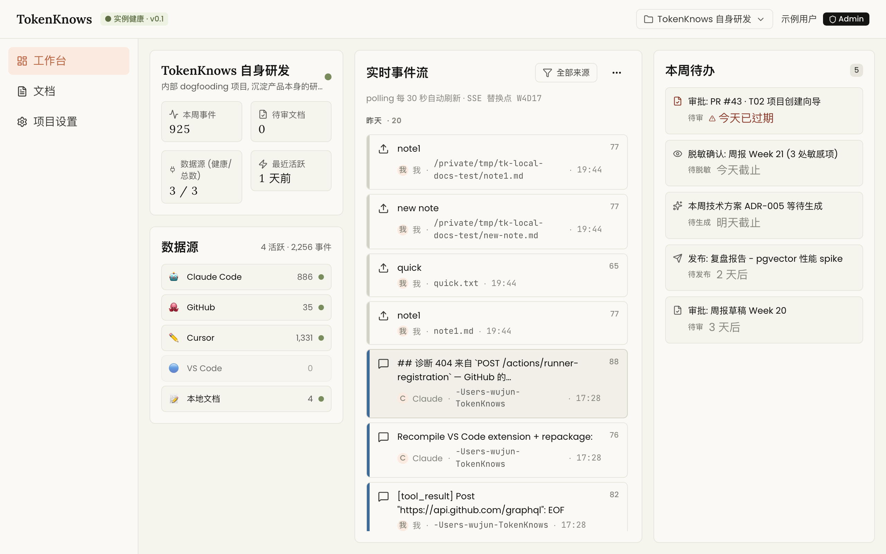](engineering_handoff/demo-screenshots/01-workbench.png) | [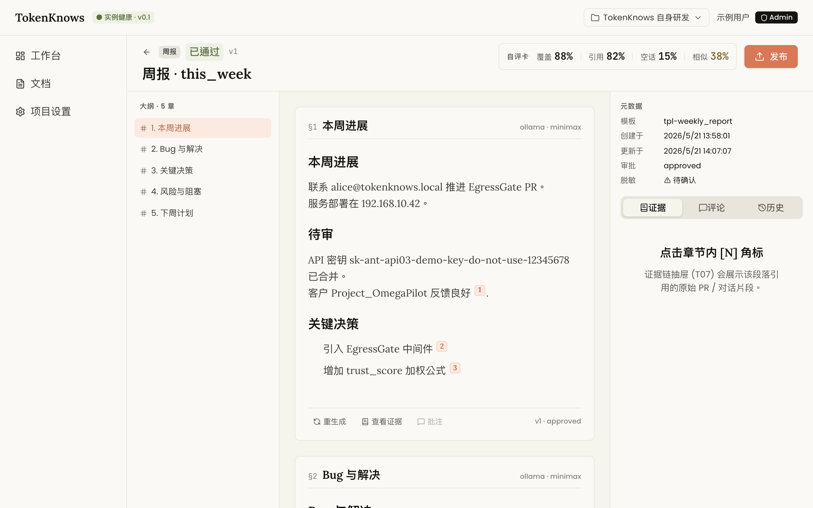](engineering_handoff/demo-screenshots/04-document-page.png) |
| **证据链抽屉** | **发布回执 + 版本 diff** |
| [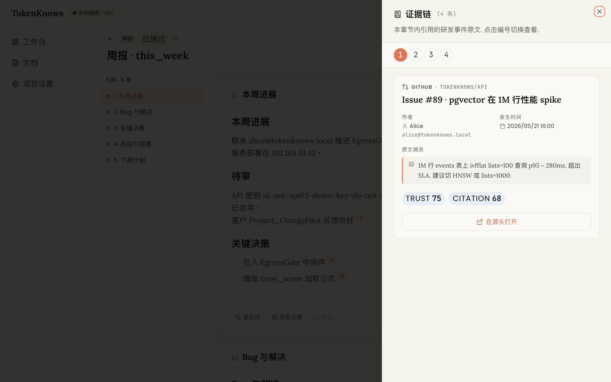](engineering_handoff/demo-screenshots/05-evidence-drawer.png) | [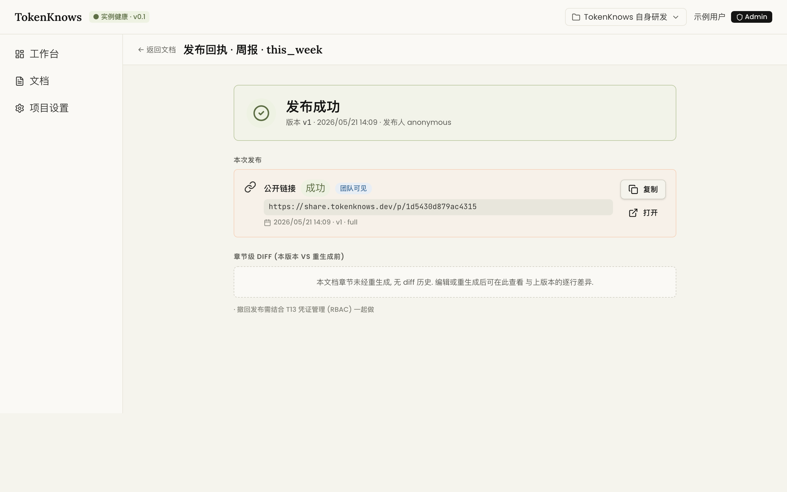](engineering_handoff/demo-screenshots/10-publish-receipt.png) |

▶ 完整录屏: [`engineering_handoff/walkthrough.mp4`](engineering_handoff/walkthrough.mp4)(5.6 MB,5 分钟,中文配音 + 字幕)

<details>
<summary>全部 12 个关键画面</summary>

| 1 工作台 | 2 事件抽屉 | 3 文档列表 | 4 文档结果页 |
|---|---|---|---|
| [](engineering_handoff/demo-screenshots/01-workbench.png) | [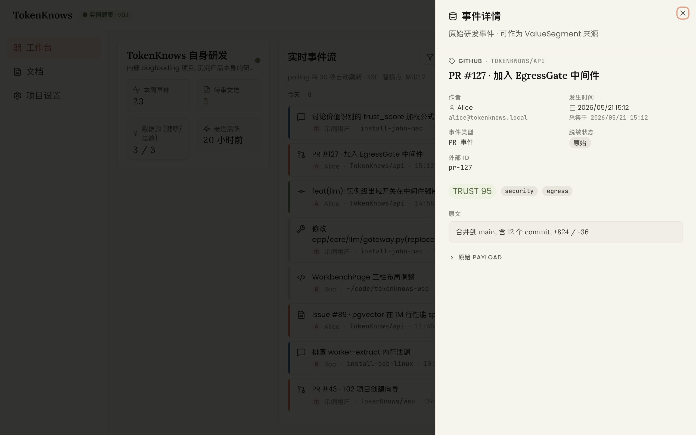](engineering_handoff/demo-screenshots/02-event-drawer.png) | [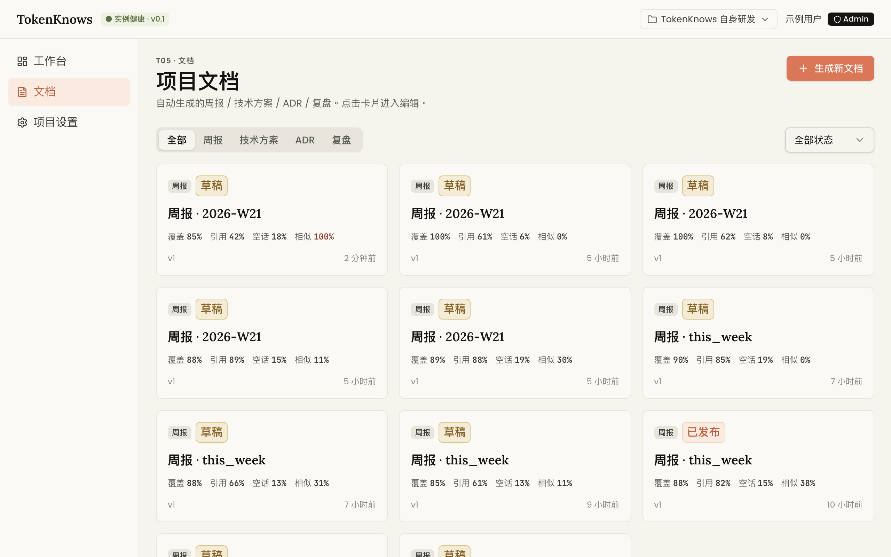](engineering_handoff/demo-screenshots/03-document-list.png) | [](engineering_handoff/demo-screenshots/04-document-page.png) |
| **5 证据链抽屉** | **6 重生成对话框** | **7 审批视图** | **8 脱敏确认** |
| [](engineering_handoff/demo-screenshots/05-evidence-drawer.png) | [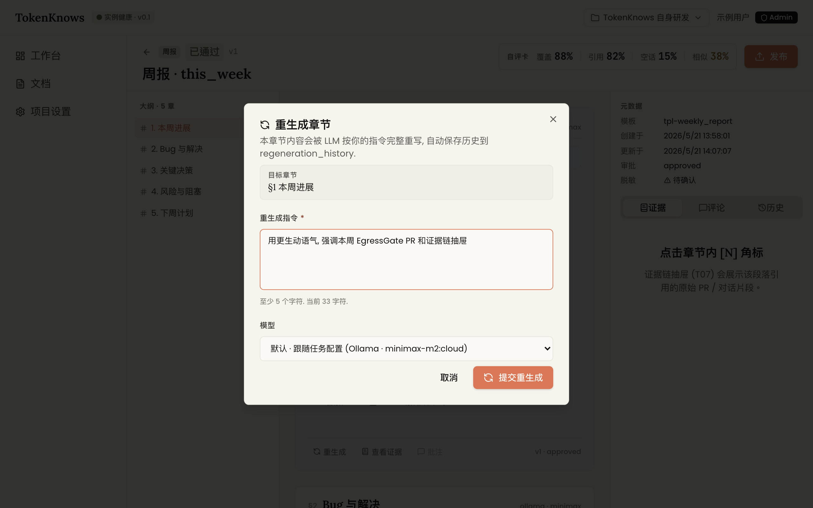](engineering_handoff/demo-screenshots/06-regenerate-dialog.png) | [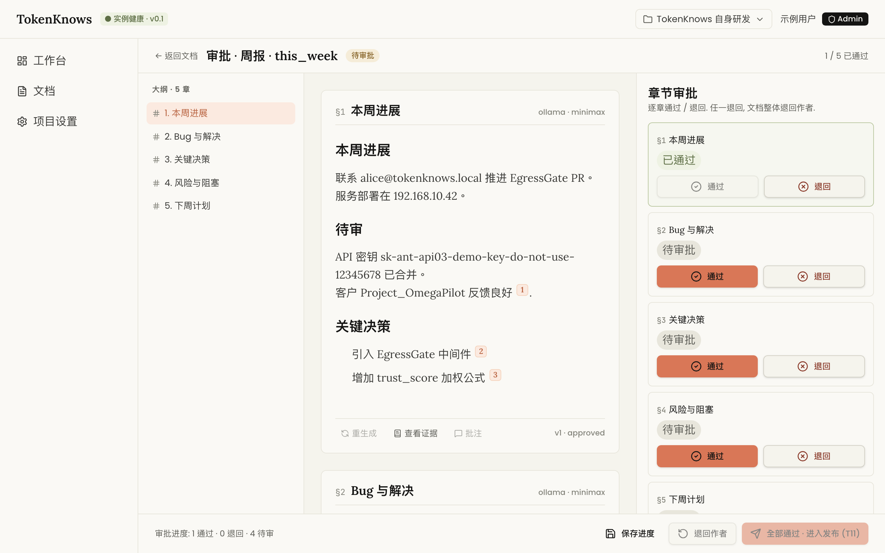](engineering_handoff/demo-screenshots/07-review-page.png) | [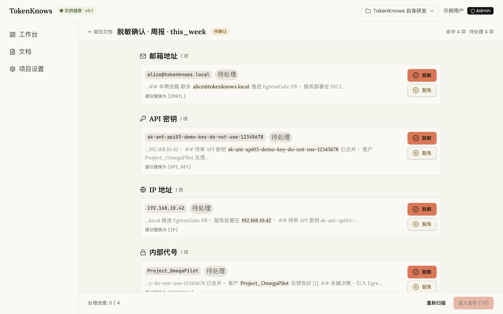](engineering_handoff/demo-screenshots/08-redaction-page.png) |
| **9 发布对话框** | **10 发布回执 + diff** | **11 LLM 出域** | **12 实例管理** |
| [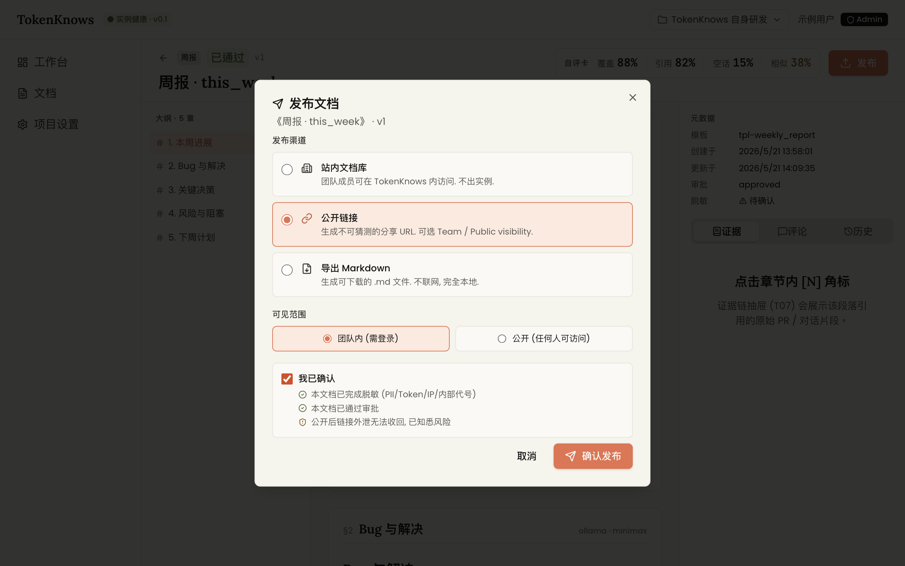](engineering_handoff/demo-screenshots/09-publish-dialog.png) | [](engineering_handoff/demo-screenshots/10-publish-receipt.png) | [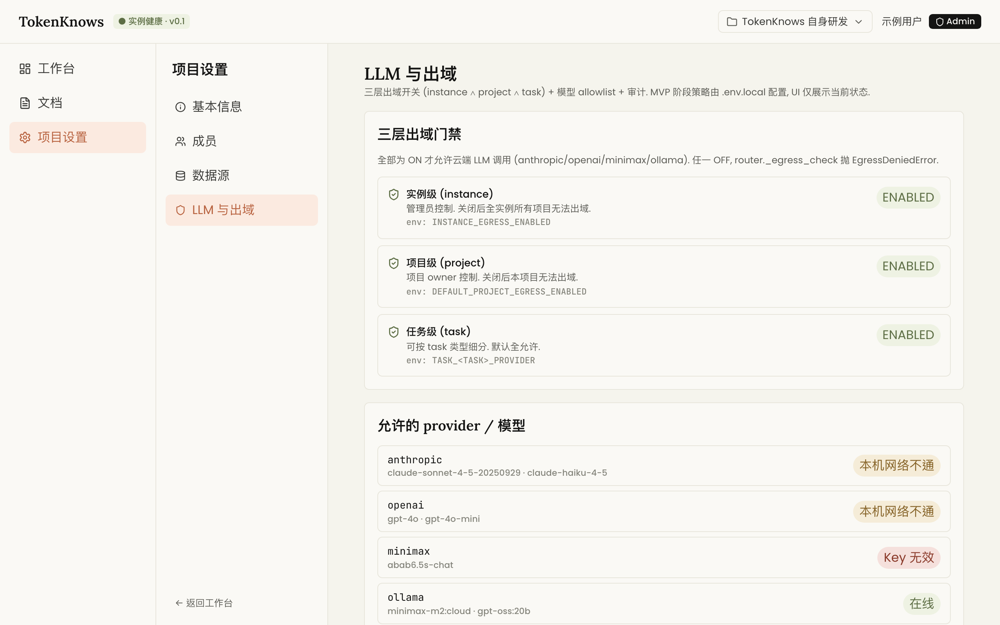](engineering_handoff/demo-screenshots/11-settings-llm.png) | [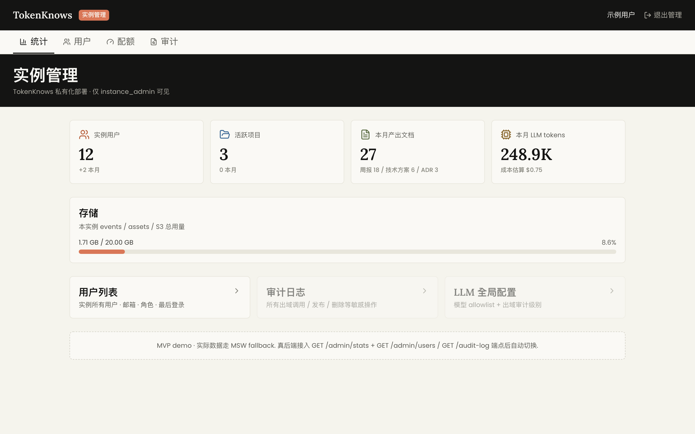](engineering_handoff/demo-screenshots/12-admin.png) |

</details>

## 🔌 安装插件 (在你的 AI 工具里用 TokenKnows)

前置:后端跑在 `http://localhost:8001`,**Web 前端跑在 `http://localhost:5173`**(见下方 Quick Start),外加 [uv](https://docs.astral.sh/uv/)(插件经 `uvx` 从 PyPI 拉起 MCP server)。所有插件环境变量都有本机默认值——只有非默认部署才需要 export(`TOKENKNOWS_API_BASE` / `TOKENKNOWS_API_TOKEN` / `TOKENKNOWS_DEFAULT_PROJECT` / `TOKENKNOWS_WEB_BASE`)。后端开了鉴权时,在 Web 注册/登录后到 **项目设置 → MCP 接入** 自助创建 API token。

| 平台 | 安装方式 |
|---|---|
| **Claude Code** | `/plugin marketplace add johnnywuj81/tokenknows` → `/plugin install tokenknows@tokenknows`,完整步骤见 [tokenknows-plugin/README.md](tokenknows-plugin/README.md)(5 分钟跑通) |
| **Codex** | `codex plugin marketplace add johnnywuj81/tokenknows` → `codex plugin add tokenknows@tokenknows`(skills / commands / MCP server 一并加载;本地 clone 备选方案见 [codex-plugin/README.md](codex-plugin/README.md)) |
| **Cursor** | `~/.cursor/mcp.json` 加 tokenknows MCP 块(uvx 配置示例见 [code/tokenknows-mcp/README.md](code/tokenknows-mcp/README.md)) |
| **VS Code** | 从 [Releases](https://github.com/johnnywuj81/tokenknows/releases) 下载 `.vsix` → `code --install-extension tokenknows-vscode-*.vsix` |

## 🚀 Quick Start · 三步本机起来

```bash
# 1. (可选但推荐) 启动 Ollama — 全本地推理, 不需要任何云端 key
ollama serve &
ollama pull minimax-m2:cloud   # 或 gpt-oss:20b 等

# 2. 起后端 (FastAPI + SQLite 持久化 + LLM Gateway 三层出域门禁)
cd code/tokenknows-api
python3 -m venv .venv && .venv/bin/pip install -e ".[dev]"
cp .env.local.example .env.local        # 默认走 Ollama, 改这里接云端
.venv/bin/uvicorn app.main:app --host 127.0.0.1 --port 8001

# 3. 起前端 (React 19 + Vite)
cd code/tokenknows-web
npm install
npm run dev
# 打开 http://localhost:5173 — 默认直连真后端 (mock 已默认关闭, ?msw=1 才启用)

# (可选) 一键准备演示数据
./engineering_handoff/demo-seed.sh
```

**平台支持**:macOS 全功能(采集器 launchd 自启);Linux 后端/前端/采集器手动跑均可(launchd 脚本不适用);Windows 未测试,建议 WSL2。

## 📡 数据采集 · 6 个采集器

> 全本地,不需要 ngrok / 公网 webhook。崩溃自动重启,系统重启自动拉起(macOS launchd)。

| 采集器 | 来源 | 触发模式 |
|---|---|---|
| **claude-code** | `~/.claude/projects/*.jsonl` | 30s 轮询(增量 offset) |
| **codex** | `~/.codex/sessions/**/rollout-*.jsonl` | 30s 轮询(增量 offset) |
| **cursor** | `Cursor/.../state.vscdb`(只读 SQLite) | 60s 轮询 |
| **github** | GitHub REST API · PR / Issue / Commit | 5min 轮询(`gh auth` 取 token) |
| **vscode** | VS Code 扩展 `onDidSaveTextDocument` | buffer + 10s flush |
| **local-docs** | `~/Documents/*.md` `.txt` `.pdf`(watchdog) | 实时 + 2s debounce |

```bash
# 5 个 python 采集器 → macOS LaunchAgent (一键)
./scripts/launchd/install.sh
launchctl list | grep com.tokenknows
tail -f ~/Library/Logs/tokenknows/*.log
```

每个事件带 trust_score(`0.6×来源权威 + 0.4×抽取置信`);证据链按 `0.6×cosine + 0.25×trust + 0.15×recency` 排序,强制跨 ≥2 个来源。

## 🏗 架构

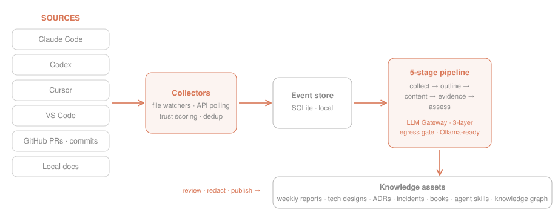

采集插件 → 事件库(SQLite)→ 5 阶段流水线(collect → outline → content → evidence → assess)→ 知识资产(7 类文档)→ 审批 / 脱敏 / 发布。LLM Gateway 统一 4 家 provider(Anthropic / OpenAI / MiniMax / Ollama),按任务路由 + 故障链回退。

## 🔧 CI · 双轨

| Workflow | Runner | 触发 |
|---|---|---|
| [`ci.yml`](.github/workflows/ci.yml) | ubuntu-latest(GitHub-hosted) | push main + 所有 PR |
| [`ci-macos.yml`](.github/workflows/ci-macos.yml) | self-hosted macOS ARM64 | 仅 main push(绝不跑外部 PR 代码) |

## 📚 文档导航

| 想了解… | 看这份 |
|---|---|
| 产品做什么 / 为什么 | [BRD](docs/product/BRD_AI研发知识资产引擎.md) |
| 产品验收 / 用户旅程 / NFR | [PRD](docs/product/PRD_TokenKnows_MVP.md) |
| 技术架构 / API / Schema | [TDD](docs/product/TDD_TokenKnows_MVP.md) |
| 颜色 / 字体 / 组件 / 每屏视觉 | [DesignHandoff](docs/product/DesignHandoff_TokenKnows_MVP.md) |
| 宏观施工动线 / 里程碑 | [Architecture](engineering_handoff/Architecture.md) |
| 每屏工程决策 / 已知坑 | [TaskTechDesign](engineering_handoff/TaskTechDesign.md) |
| 像素级视觉对照 | [mockups/](mockups/) 浏览器直接打开 |

## 🔒 私有化承诺

- 默认零出域 · 三层 LLM 开关(实例 ∧ 项目 ∧ 任务)全 ON 才允许云端调用
- 密钥自管 · 完整出域审计仅留本地
- 一键关停 · 紧急情况进入全离线模式

详见 [PRD §6.7 数据驻留与出域控制](docs/product/PRD_TokenKnows_MVP.md)。

## 🤝 社区

[CONTRIBUTING](CONTRIBUTING.md) · [Roadmap](ROADMAP.md) · [Code of Conduct](CODE_OF_CONDUCT.md) · [Security](SECURITY.md) · [Issues](https://github.com/johnnywuj81/tokenknows/issues)

## License

[MIT](LICENSE) © 2026 johnnywuj81
